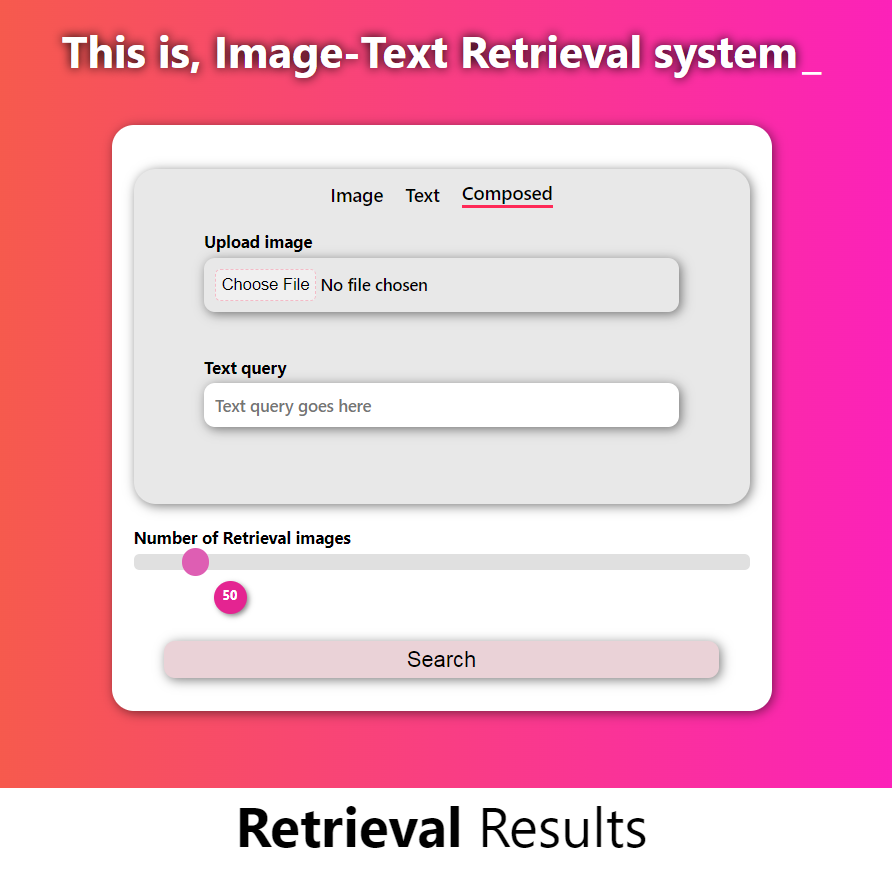
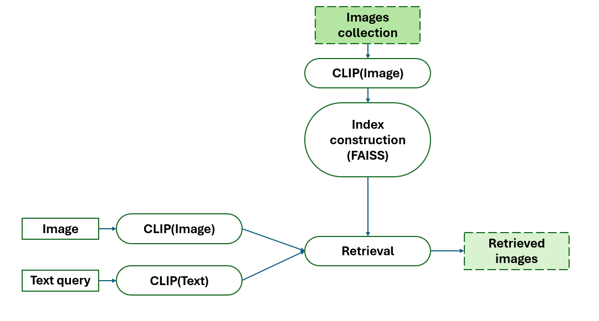
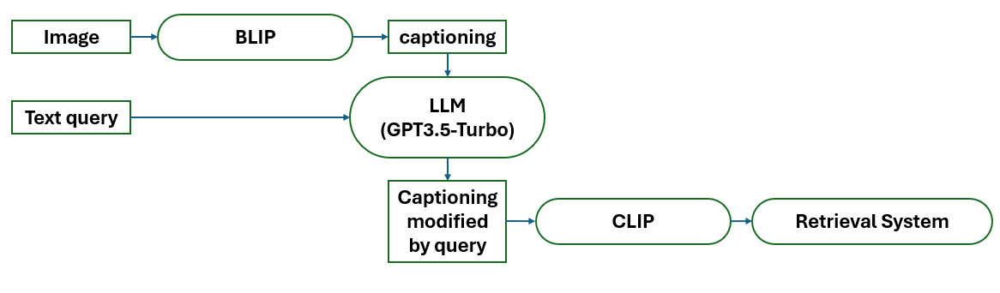

<h1 style="text-align: center;"><b>This is massive retrieval system</b></h>
  <p align="middle">
    
  </p>
  
  ## ***powered by***
  
  
  <p align="middle">
    
    
    
    
    
  </p>

## **Image-text Retrieval system**


Image retrieval system is a system that can search for images in a large database based on the content of the image. The content of the image can be the image itself or the text that describes the image. The image retrieval system can be used in many applications such as image search engines, image recommendation systems, and image-based question-answering systems. The image retrieval system can be divided into two main types: image-based retrieval and text-based retrieval. In image-based retrieval, the system searches for images based on the content of the image itself. In text-based retrieval, the system searches for images based on the text that describes the image.


<p align="middle">
        
</p>


  ## **Composed Retrieval system**

The composed retrieval system is a system that can search for images in a large database based on the content of the image and the text that describes the image. The composed retrieval system can be used in many applications such as image search engines, image recommendation systems, and image-based question-answering systems. 
  Composed image-text overview
    <p align="middle">
        
    </p>

  ---
  ## **User guide**

  You need to down imagenet1k 2012 validation set include 50000 images at [homepage](https://image-net.org/download.php). Then extract it to `./data/images/` folder. Your file structure should be like this:
  ```console
    ├── data
    │   ├── images
    │   │   ├── ILSVRC2012_val_00000001.JPEG
    │   │   ├── ILSVRC2012_val_00000002.JPEG
    │   │   ├── ILSVRC2012_val_00000003.JPEG
    │   │   .......
    │   │   ├── ILSVRC2012_val_00050000.JPEG
  ```

  You need to install docker [Here](https://docs.docker.com/desktop/)

  Run following command:
  install git if you don't have before
  ```console
  sudo apt-get update
  sudo apt-get install git-all
  git version
  ```
  ```python
  # consider git lfs file *.index
  git clone https://github.com/4ursmile/Massive-image-text-retrieval-system
  cd Massive-image-text-retrieval-system .
  ```
  ```console
  docker build -t cirimage .
  ```
  Finally.
  ```console
  docker run -d -p --name circontainer cirimage .
  ```
  That's for backend server
  now you need to run frontend. just > open index.html in any browser.
  

  Our works
  > - [x] provide demo composed image retrieval system on image net.
  > - [ ] Allow user update image.
  > - [ ] Allow user built custom index on custom dataset.
  ---
  ---
  ---
  